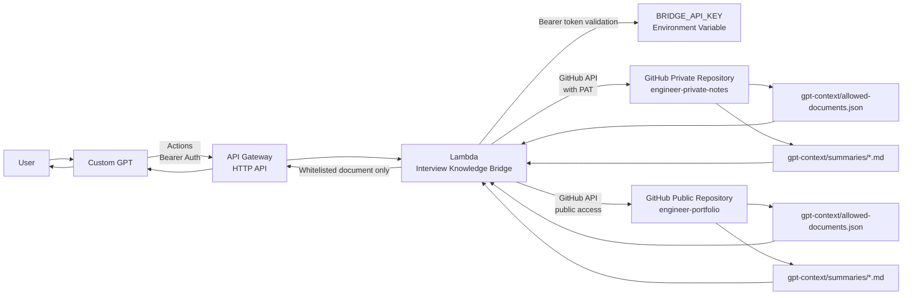
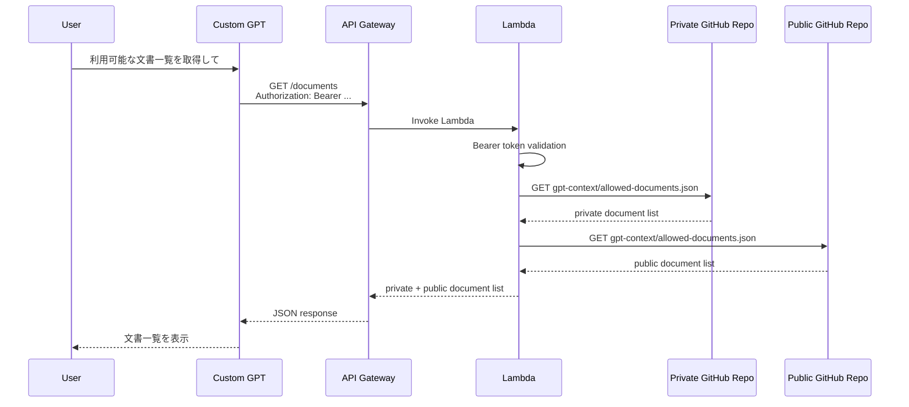
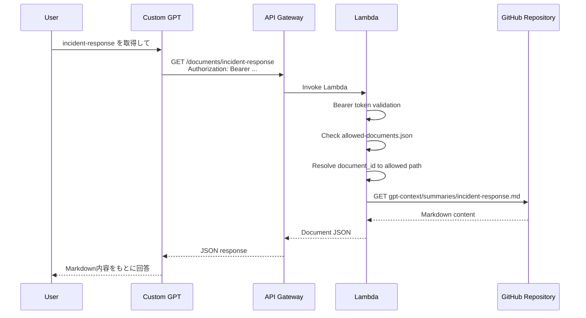

# Architecture

## Overview

Interview Knowledge Bridge は、Custom GPT（Custom GPT）から GitHub リポジトリ上の許可済みMarkdownを参照するための中継APIです。

Custom GPT が Private GitHub Repository を直接参照するのではなく、API Gateway と Lambda を経由して、許可された文書のみ取得します。

## Current Architecture



## Request Flow

### 1. Document List



### 2. Document Detail



## Components

### Custom GPT

Custom GPT は Custom GPT Actions を利用して API Gateway のエンドポイントを呼び出します。

Custom GPT は GitHub の Private Repository を直接参照しません。
API呼び出し時には Bearer 形式で `BRIDGE_API_KEY` を送信します。

```text
Authorization: Bearer <BRIDGE_API_KEY>
```

### API Gateway

API Gateway は、外部から Lambda を HTTP API として呼び出すための入口です。

主な役割は以下です。

* HTTPSエンドポイントの提供
* `/health`, `/documents`, `/documents/{document_id}` のルーティング
* Lambdaへのリクエスト中継
* Lambdaレスポンスの返却

今回のMVPでは、認証処理そのものは API Gateway ではなく Lambda 側で実装しています。

### Lambda

Lambda は中継APIの中心です。

主な役割は以下です。

* Bearer token の検証
* `allowed-documents.json` の読み込み
* `document_id` が許可済みか確認
* 許可されたMarkdownのみGitHubから取得
* Custom GPTへJSONとして返却

Lambda は GitHub PAT を持つため、権限上は Private Repository を読み取れます。
そのため、API利用者へ返す情報は Lambda 側で制御します。

### GitHub Private Repository

Private Repository には、面接準備や学習メモなど、外部公開しない情報を配置します。

```text
engineer-private-notes/
└── gpt-context/
    ├── allowed-documents.json
    └── summaries/
        ├── linux-replace.md
        ├── incident-response.md
        ├── dev-marathon.md
        └── physical-network.md
```

### GitHub Public Repository

Public Repository には、公開ポートフォリオとして見せられる情報を配置します。

```text
engineer-portfolio/
└── gpt-context/
    ├── allowed-documents.json
    └── summaries/
        ├── portfolio-index.md
        └── interview-knowledge-bridge.md
```

## Security Design

### Authentication

Custom GPT は Bearer 形式で `BRIDGE_API_KEY` を送信します。

Lambda はリクエストヘッダーの `Authorization` を確認し、環境変数に保存された `BRIDGE_API_KEY` と一致する場合のみ処理を続行します。

```text
Custom GPT
  ↓ Authorization: Bearer <BRIDGE_API_KEY>
API Gateway
  ↓
Lambda
  ↓ Compare with environment variable
BRIDGE_API_KEY
```

### GitHub Access

Private Repository の参照には GitHub fine-grained PAT を使用します。

```text
Lambda
  ↓ GitHub REST API with PAT
GitHub Private Repository
```

Public Repository は公開リポジトリのため、トークンなしで参照できます。

### Whitelist Control

API利用者は任意のファイルパスを指定できません。

受け付けるのは `document_id` のみです。

```text
GET /documents/incident-response
```

Lambda は `allowed-documents.json` を読み込み、`document_id` に対応する許可済みパスだけを取得します。

```json
{
  "documents": [
    {
      "id": "incident-response",
      "title": "障害対応演習",
      "path": "gpt-context/summaries/incident-response.md"
    }
  ]
}
```

この設計により、Private Repository 全体を Custom GPT に開放せず、許可済みMarkdownだけを参照させることができます。

## Important Note

Lambda は GitHub PAT を持っているため、権限上は Private Repository 内のファイルを読むことができます。

そのため、Lambdaコードに不備があると、PATの権限内で本来返すべきでないファイルを返してしまうリスクがあります。

このリスクを抑えるため、以下の設計にしています。

* API利用者から任意のファイルパスを受け取らない
* `document_id` のみ受け取る
* `document_id` から取得パスへの変換は `allowed-documents.json` のみで行う
* 取得可能なパスを `gpt-context/summaries/` 配下に制限する
* `.md` ファイルのみ取得対象にする
* `..` を含むパスを拒否する

## API Endpoints

### Health Check

```text
GET /health
```

認証なしでAPIの疎通確認を行います。

### List Documents

```text
GET /documents
Authorization: Bearer <BRIDGE_API_KEY>
```

取得可能な文書一覧を返します。

### Get Document

```text
GET /documents/{document_id}
Authorization: Bearer <BRIDGE_API_KEY>
```

指定された `document_id` が許可済みの場合のみ、対応するMarkdownを返します。

## Environment Variables

```text
BRIDGE_API_KEY=Bearer認証用の共有秘密
GITHUB_TOKEN=Private Repository読み取り用のGitHub fine-grained PAT
GITHUB_OWNER=qp-git
GITHUB_REPO=engineer-private-notes
GITHUB_BRANCH=main
GITHUB_PUBLIC_OWNER=qp-git
GITHUB_PUBLIC_REPO=engineer-portfolio
GITHUB_PUBLIC_BRANCH=main
```

## Summary

この構成では、Custom GPT に GitHub Private Repository の権限を直接渡さず、API Gateway + Lambda を中継させています。

Lambda は GitHub PAT を使って Private Repository を参照できますが、外部に返す文書は `allowed-documents.json` によって制御します。

これにより、Privateな学習メモをそのまま公開せず、Custom GPTが必要な情報だけを安全に取得できる構成にしています。

